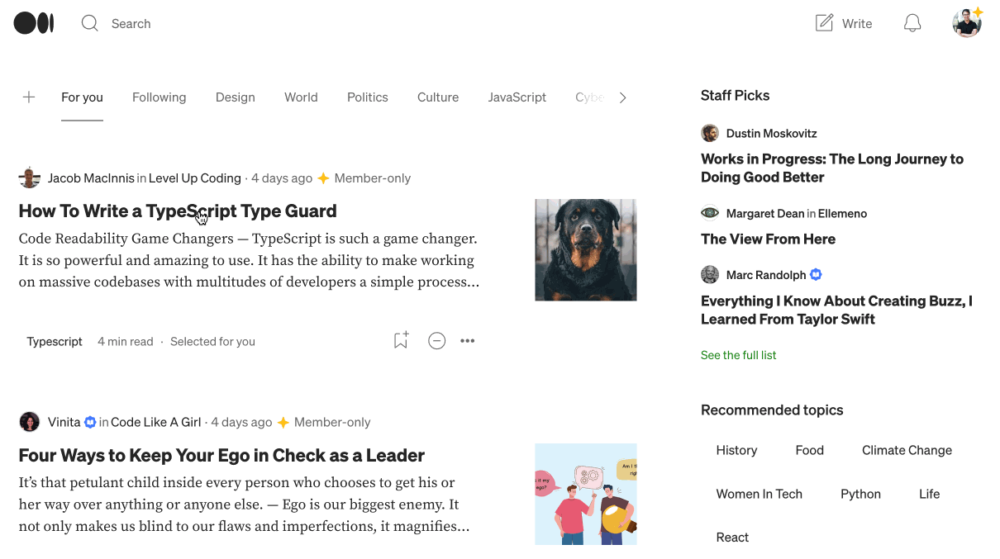

# Worth the Click

A Chrome extension which uses the Power of [OpenAI](https://openai.com/) and [Langchain](https://js.langchain.com/docs/get_started/introduction) to summarize an external link when hovering over it.



## Idea


## Development

We use [Bun](https://bun.sh/), a fast all-in-one JavaScript runtime.
This project was created using `bun init` in bun v1.0.25.

```bash
bun install
```

To run:

```bash
bun dev
```

It runs [Bun's watch](https://bun.sh/guides/read-file/watch) and a local [server](#server).

### Server

The server uses [Miniflare](https://github.com/cloudflare/workers-sdk/tree/main/packages/miniflare) alongside with [Hono and Cloudflare Worker](https://hono.dev/getting-started/cloudflare-workers).

Start the server

```bash
bun server
```

### Load an unpacked extension

The output file will be put inside `dist` as `index.js`. Use that to install it.

In development, you need to add this extension.
Please, check out [this tutorial](https://developer.chrome.com/docs/extensions/get-started/tutorial/hello-world#load-unpacked).

## Blogs

I write a (hopefully) comprehensive series about this repository.

- [Part 1](https://dev.to/jolodev/developing-your-own-chrome-extension-the-theory-part-1-2d93)
- [Part 2](https://dev.to/jolodev/developing-your-own-chrome-extension-in-bun-and-typescript-part-2-50h7)
- [Part 3](https://dev.to/jolodev/developing-your-own-chrome-extension-with-openai-and-langchain-part-3-4nbl)
- [Part 4](https://dev.to/jolodev/developing-your-own-chrome-extension-fixing-errors-with-ts-morph-and-using-buns-api-part-4-3hni)
- [Part 5](https://dev.to/jolodev/developing-your-own-chrome-extension-fetch-with-a-proxy-and-cloudflare-workers-part-5-95j)
